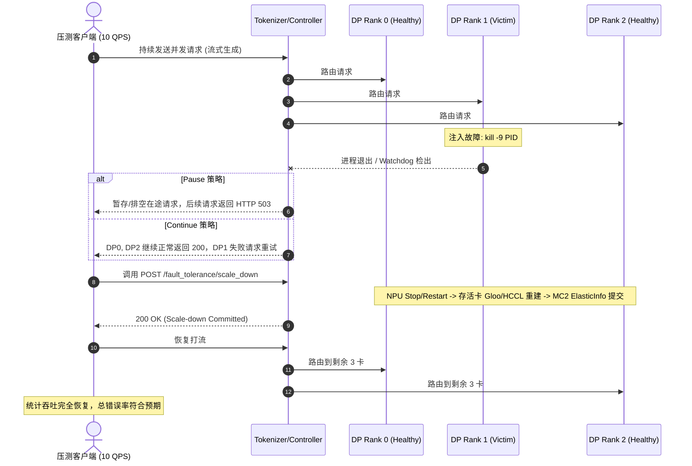

# SGLang NPU MC2 故障注入与容错缩容实验方案

本方案针对 Ascend NPU (MindIE MC2 MoE) 与 DP-Only Fault Tolerance 框架，设计了一套覆盖**空闲/并发推理**、**Pause/Continue 策略**、**混合故障源**、**TP > 1 并行**以及**多卡连续级联故障**的完整故障注入实验计划。

---

## 一、 实验维度与场景矩阵

| 编号 | 场景名称 | 并行拓扑 | FT 策略 | 业务状态 | 故障注入方式 | 缩容目标 | 核心验证点 |
| :--- | :--- | :--- | :--- | :--- | :--- | :--- | :--- |
| **EXP-1** | **空闲基线缩容测试** | DP=4, TP=1, EP=4 | Pause vs Continue | 空闲（无请求） | ① 直接 API 缩容<br>② 杀进程后缩容 | DP 4 $\to$ 3 | 验证无流量下两种策略的基线缩容能力与状态机转换 |
| **EXP-2** | **推理并发中动态缩容** | DP=4, TP=1, EP=4 | Pause & Continue | 高并发持续打流 (In-Flight) | `kill -9` 杀掉 1 个 Scheduler 进程 | DP 4 $\to$ 3 | 验证在途请求排空/重试、503 拦截、存活实例零死锁与吞吐恢复 |
| **EXP-3** | **Pause vs Continue 策略对比** | DP=4, TP=1, EP=4 | Pause / Continue 对比 | 持续打流 | 注入 Rank 故障（模拟异常） | DP 4 $\to$ 3 | **Pause**：全局熔断拒绝接流；<br>**Continue**：非故障 DP 继续服务，仅剔除坏卡 |
| **EXP-4** | **混合故障源注入测试** | DP=4, TP=1, EP=4 | Pause / Continue | 持续打流 | ① Rank 0 抛应用层 Exception<br>② Rank 1 触发 Watchdog 物理 SIGKILL | DP 4 $\to$ 2 | 混合故障源并发到达时，Controller 状态机聚合与两阶段规整 |
| **EXP-5** | **TP > 1 并行容错缩容** | DP=2, TP=2, EP=2 或<br>DP=4, TP=2, EP=4 | Pause | 持续打流 | 随机 kill 某个 DP 实例内部的 1 个 TP Worker | 剔除整个故障 DP 单元 | 验证一个 DP 包含多张卡时，整个 DP 单元被协同隔离与权重迁移 |
| **EXP-6** | **多卡并发 / 连续级联缩容** | DP=4, TP=1, EP=4 | Pause | 持续打流 | ① 一次性同时 kill 2 卡<br>② 顺序连续缩容 (4 $\to$ 3 $\to$ 2) | DP 4 $\to$ 2 | 验证多专家同时缺失时的 DRAM 补录、连续多次重建通信域的稳定性 |

---

## 二、 详细实验设计与执行步骤

### 实验 1：空闲状态基线缩容（啥都没做直接缩容 vs 故障后缩容）

#### 1. 实验目标
验证在没有并发业务压力下，直接调用 scale-down API 或故障后调用 scale-down 的基本功能，对比 `pause` 与 `continue` 表现。

#### 2. 测试步骤
1. 启动服务（DP=4, TP=1, EP=4, 预留 44 个冗余专家槽位）。
2. 发送 1 个 Warmup 请求，记录标准输出文本与 Token 序列。
3. **分支 A（直接缩容）**：不杀任何进程，直接调用 `/fault_tolerance/scale_down` 指定 `removed_ranks=[3]`。
4. **分支 B（故障后缩容）**：`kill -9` 杀掉 Rank 3 的 Scheduler 进程 $\to$ 等待状态变为 `dead` $\to$ 调用 `/fault_tolerance/scale_down`。
5. 分别在 `ft_strategy="pause"` 和 `ft_strategy="continue"` 下执行。
6. 发送验证请求，校验推理结果与性能。

#### 3. 预期判定
- **分支 A**：无报错，存活 3 卡成功重建通信域，Active DP Mask 变为 `[1, 1, 1, 0]`，直接缩容成功。
- **分支 B**：Watchdog 捕获 Rank 3 死亡，调用 scale_down 后成功复活到 3 卡集群。
- 缩容后请求输出与基线完全一致，无精度漂移。

---

### 实验 2：推理并发中（In-Flight）动态缩容与故障自愈

#### 1. 实验目标
模拟生产真实高负载场景，验证推理流水线在执行过程中发生节点崩溃时的请求韧性、错误码行为和吞吐自愈时间。

#### 2. 测试步骤


1. 启动并发压测脚本，以 10 ~ 20 QPS 持续发送生成请求（记录请求成功率、时延抖动）。
2. 在第 10 秒时，向 Scheduler DP1 发送 `SIGKILL`。
3. 监控客户端收到的响应状态码分布（200、503、Connection Error）。
4. 调用 `/fault_tolerance/scale_down` 触发存活节点重平衡。
5. 观测服务恢复时间（Recovery Window）及后续流量承载情况。

#### 3. 预期判定
- **Pause 策略**：故障发生后立即拦截新请求返回 503（`fault_tolerance_paused`），缩容完成后 503 自动消失，恢复 100% 成功率。
- **Continue 策略**：发往 DP0、DP2、DP3 的请求全程不受影响（持续返回 200），发往 DP1 的请求由上层重试或快速失败。
- 存活卡 NPU 显存无泄漏，未发生 HCCL 通信死锁。

---

### 实验 3：FT 策略行为深度对比（Pause 全局暂停 vs Continue 局部降级）

#### 1. 实验目标
对比两种 FT 策略在故障注入期间的系统表现与吞吐对比。

#### 2. 对比指标项
| 测试维度 | `fault-tolerance-on-error-strategy pause` | `fault-tolerance-on-error-strategy continue` |
| :--- | :--- | :--- |
| **故障感知时流量行为** | 全局拒绝新请求，统一返回 `503 Service Unavailable` | 仅将故障 DP 踢出路由 Mask，其余健康 DP 继续处理请求 |
| **在途请求（In-Flight）** | 暂停所有调度器，排空当前批次 | 健康调度器正常推进，故障调度器上的请求超时重试 |
| **状态机标记** | `cluster_paused = True` | `cluster_paused = False`，仅更新 `active_dp_mask` |
| **适合场景** | 对数据一致性要求极高、不允许局部流量分流的批处理推理 | 高可用在线服务、要求故障期间整体服务不中断 |

---

### 实验 4：混合故障源注入测试（应用层 Exception 与 Watchdog 杀进程）

#### 1. 实验目标
验证当集群中同时存在**软故障（Python 异常/死循环被探测）**与**硬故障（进程暴毙 SIGKILL）**时，Controller 状态机的鲁棒性。

#### 2. 测试步骤
1. 启动 4 卡集群。
2. **第一阶段注入**：调用 `/fault_tolerance/inject_rank_fault` 向 Rank 1 注入异常，Rank 1 状态变为 `unhealthy`。
3. **第二阶段注入**：在 Rank 1 处于 unhealthy 但尚未缩容时，直接 `kill -9` 杀掉 Rank 2 进程，Rank 2 状态变为 `dead`。
4. 查询 `/fault_tolerance/status`，断言：
   - Rank 0: `healthy`
   - Rank 1: `unhealthy`
   - Rank 2: `dead`
   - Rank 3: `healthy`
5. 调用 `/fault_tolerance/scale_down` 一次性传入 `removed_ranks=[1, 2]`。
6. 验证 Rank 0 和 Rank 3 组建成 2 卡集群，重新分担全部 128 个逻辑专家。

#### 3. 预期判定
- Controller 能正确聚合多种故障事件，不会因为事件交错导致状态死锁。
- EPLB 能正确计算出跨越两张故障卡的补录方案，缺失专家从 DRAM/磁盘正确补录至 Rank 0 和 Rank 3。

---

### 实验 5：TP > 1 并行拓扑容错缩容（以 DP=2, TP=2 为例）

#### 1. 实验目标
验证 `tp_size > 1`（一个 DP 实例绑定多张卡）时，Fault Tolerance 能够按 **DP 单元（DP Unit）** 进行整组隔离与缩容。

#### 2. 拓扑与参数
- 启动拓扑：`--tp-size 2 --dp-size 2 --ep-size 2`（共 4 张卡，分为 DP0[Rank 0, 1] 和 DP1[Rank 2, 3]）。
- `global_rank_count = 4`，`global_ranks_per_dp = 2`。

#### 3. 测试步骤
1. 启动服务，发送测试请求建立基线。
2. 仅向 **Rank 3**（DP1 内部的第 2 个 TP Worker）发送 `SIGKILL`。
3. 查询 `/fault_tolerance/status`：
   - 验证 Controller 能够通过 `global_ranks_for_dp(1)` 正确将 DP1 的全局状态标记为失效。
4. 调用 `/fault_tolerance/scale_down` 指定剔除 `dp_rank=1`。
5. 此时 DP0（Rank 0, Rank 1）协同完成重平衡，成为唯一的存活推理单元。
6. 发送请求验证 TP=2 内部的 AllReduce 与跨卡注意力是否正常。

#### 4. 预期判定
- 单个 TP Worker 挂掉能够正确引发其所属的整个 DP Rank 下线，不会导致同组内的其他 TP Worker 孤儿挂起。
- 缩容后 TP 组内通信正常，MoE 与 Dense 部分精度正确。

---

### 实验 6：多卡并发与连续级联缩容测试（4 $\to$ 3 $\to$ 2 阶梯缩容）

#### 1. 实验目标
验证连续发生多次故障并相继缩容（多次调用 `_stop_and_restart_npu_device_for_fault_tolerance` 与重构通讯域）的长期稳定性。

#### 2. 测试步骤与时序
```text
[4 卡集群 DP=4]
      │
      ├─► 步骤 1: 杀掉 Rank 3 ──► 调用 scale_down([3]) ──► 验证 3 卡 (Rank 0,1,2) 正常生成
      │
      └─► 步骤 2: 再杀掉 Rank 2 ──► 调用 scale_down([2]) ──► 验证 2 卡 (Rank 0,1) 正常生成
```

1. **第一轮缩容（4 $\to$ 3）**：
   - Kill Rank 3，执行 scale-down，验证生成 20 条请求，校验 Token 准确率。
   - 验证 Generation ID 自增（`generation = 1`）。
2. **第二轮缩容（3 $\to$ 2）**：
   - 在 3 卡状态下继续杀掉 Rank 2。
   - 触发第二次 scale-down，验证 Generation ID 自增（`generation = 2`）。
   - 验证此时每个存活卡（Rank 0, Rank 1）各分担 64 个专家（已达物理槽位上限）。
3. **边界保护校验**：
   - 尝试在 2 卡状态下再杀掉 1 卡（若 $1 \times 43 < 128$，物理槽位不足以放下全部专家），验证系统是否正确触发快速熔断报错而不是未知崩溃。

#### 3. 预期判定
- 连续经历 2 次 Device Restart 与通信域重建后，NPU 驱动无死锁、无显存泄露。
- 连续缩容过程中，每次的专家映射均满足 `logical_experts = 128` 完整覆盖。

---

## 三、 各种测试类型的服务启动命令与测试执行命令

每个实验均采用**双终端模式**：
- **终端 1**：启动对应拓扑和 FT 策略的 SGLang 服务（并将日志输出到 `/tmp/sglang-npu-ft.log`）。
- **终端 2**：在服务就绪后执行对应的自动化测试脚本。

---

### 1. 常规拓扑 + Pause 策略服务启动（适用于 EXP-1, EXP-2, EXP-4, EXP-6）

**适用场景**：
- EXP-1：空闲状态基线缩容测试
- EXP-2：并发推理中动态缩容测试
- EXP-4：混合故障源注入测试
- EXP-6：多卡并发与连续级联缩容测试 (4 $\to$ 3 $\to$ 2)

**【终端 1】服务启动命令**：
```bash
DEEP_USE_MODE=default python -m sglang.launch_server \
  --model-path Qwen/Qwen3-30B-A3B \
  --host 0.0.0.0 \
  --port 30000 \
  --device npu \
  --tp-size 4 \
  --dp-size 4 \
  --ep-size 4 \
  --moe-dense-tp-size 1 \
  --moe-dp-size 1 \
  --attn-cp-size 1 \
  --enable-dp-attention \
  --enable-dp-lm-head \
  --moe-a2a-backend deepep \
  --deepep-mode low_latency \
  --enable-eplb \
  --eplb-algorithm elasticity_aware \
  --ep-num-redundant-experts 128 \
  --elastic-ep-backend mc2 \
  --enable-fault-tolerance \
  --fault-tolerance-on-error-strategy pause \
  --fault-tolerance-timeout 600 \
  2>&1 | tee /tmp/sglang-npu-ft.log
```

**【终端 2】测试执行命令**：
```bash
# 运行 EXP-1：空闲状态直接缩容
python test/manual/ascend/test_fault_tolerance_suite.py --test-case idle_scale_down --victim-rank 3

# 运行 EXP-2：并发推理中动态缩容 (10 并发)
python test/manual/ascend/test_fault_tolerance_suite.py --test-case inflight_scale_down --victim-rank 3 --concurrency 10

# 运行 EXP-4：混合软硬故障注入测试 (Rank 1 软异常 + Rank 2 物理 SIGKILL)
python test/manual/ascend/test_fault_tolerance_suite.py --test-case mixed_fault_injection --soft-victim-rank 1 --hard-victim-rank 2

# 运行 EXP-6：多轮级联连续缩容 (4 -> 3 -> 2)
python test/manual/ascend/test_fault_tolerance_suite.py --test-case cascading_scale_down --cascading-ranks 3 2
```

---

### 2. Continue 策略服务启动（适用于 EXP-3）

**适用场景**：
- EXP-3：Continue 策略下的局部非阻塞故障隔离测试

**【终端 1】服务启动命令**（注意 `--fault-tolerance-on-error-strategy continue`）：
```bash
DEEP_USE_MODE=default python -m sglang.launch_server \
  --model-path Qwen/Qwen3-30B-A3B \
  --host 0.0.0.0 \
  --port 30000 \
  --device npu \
  --tp-size 4 \
  --dp-size 4 \
  --ep-size 4 \
  --moe-dense-tp-size 1 \
  --moe-dp-size 1 \
  --attn-cp-size 1 \
  --enable-dp-attention \
  --enable-dp-lm-head \
  --moe-a2a-backend deepep \
  --deepep-mode low_latency \
  --enable-eplb \
  --eplb-algorithm elasticity_aware \
  --ep-num-redundant-experts 128 \
  --elastic-ep-backend mc2 \
  --enable-fault-tolerance \
  --fault-tolerance-on-error-strategy continue \
  --fault-tolerance-timeout 600 \
  2>&1 | tee /tmp/sglang-npu-ft.log
```

**【终端 2】测试执行命令**：
```bash
python test/manual/ascend/test_fault_tolerance_suite.py --test-case strategy_continue_isolation --victim-rank 3
```

---

### 3. TP > 1 并行拓扑服务启动（适用于 EXP-5，以 DP=2, TP=2 为例）

**适用场景**：
- EXP-5：TP > 1 张量并行协同容错与 DP 单元整组隔离测试

**【终端 1】服务启动命令**（4 卡节点，划分为 2 个 DP 单元，每个 DP 内 Dense TP=2）：
```bash
DEEP_USE_MODE=default python -m sglang.launch_server \
  --model-path Qwen/Qwen3-30B-A3B \
  --host 0.0.0.0 \
  --port 30000 \
  --device npu \
  --tp-size 4 \
  --dp-size 2 \
  --ep-size 2 \
  --moe-dense-tp-size 2 \
  --moe-dp-size 1 \
  --attn-cp-size 1 \
  --enable-dp-attention \
  --enable-dp-lm-head \
  --moe-a2a-backend deepep \
  --deepep-mode low_latency \
  --enable-eplb \
  --eplb-algorithm elasticity_aware \
  --ep-num-redundant-experts 128 \
  --elastic-ep-backend mc2 \
  --enable-fault-tolerance \
  --fault-tolerance-on-error-strategy pause \
  --fault-tolerance-timeout 600 \
  2>&1 | tee /tmp/sglang-npu-ft.log
```

**【终端 2】测试执行命令**：
```bash
python test/manual/ascend/test_fault_tolerance_suite.py --test-case tp_parallel_scale_down --victim-rank 1
```

---

## 四、 核心检查项与断言准则（Pass/Fail Criteria）

1. **通信域与设备生命周期**：
   - 日志中必须依次出现 `[NPU FT] stopping survivor device` $\to$ `[NPU FT] restarted survivor device` $\to$ `[NPU FT] rebuilt graph-external process groups`。
2. **MC2 ElasticInfo 一致性**：
   - 捕获图外部的 `elasticInfo` 必须是 In-Place 更新（`data_ptr` 在缩容前后完全一致）。
3. **EPLB 专家完整性**：
   - 缩容后存活卡的物理专家槽位并集必须覆盖全部 $[0, 127]$ 逻辑专家，且无重复计算悬空专家。
4. **输出精度一致性**：
   - 在固定 Seed 与温度为 0 的设置下，故障缩容前后生成的文本 Token 序列必须与无故障基线**完全一致（Exact Match）**。
